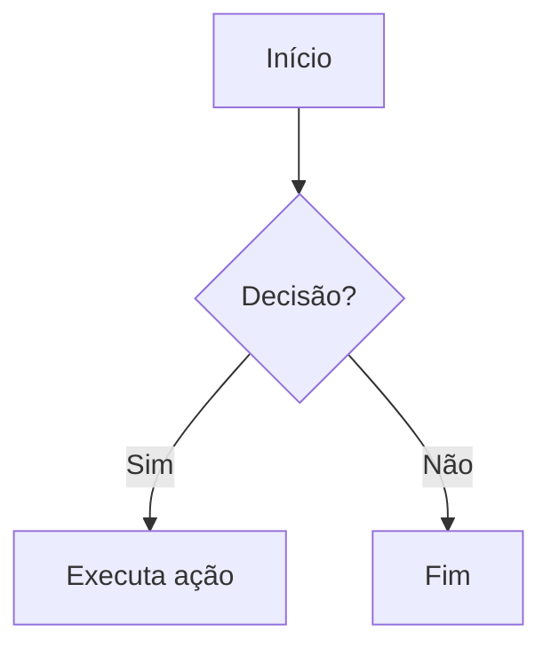
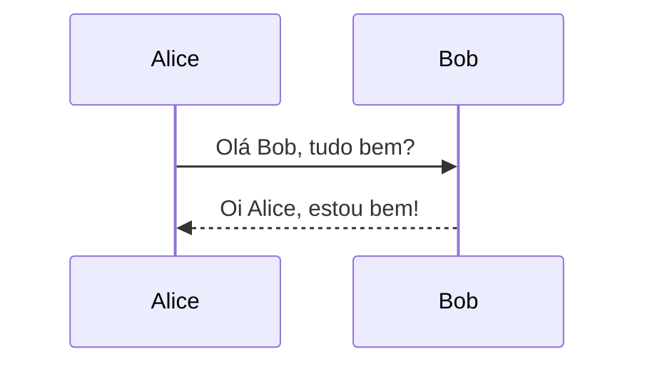
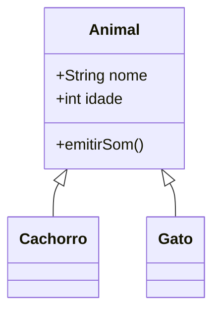
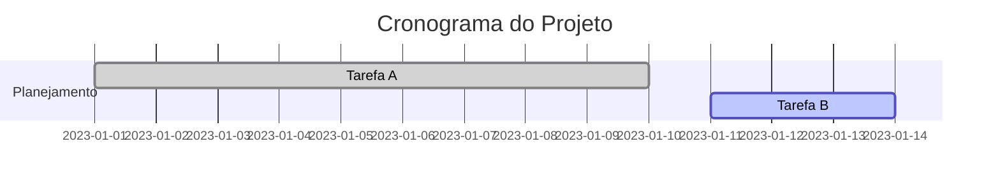

# Guia Prático da Linguagem Markdown  

<br />

Bem-vindo(a) ao **Guia Prático de Markdown**!  

Este material foi preparado especialmente para iniciantes que desejam aprender a usar o Markdown em seus **READMEs de projetos** e no **perfil do GitHub**.  

Markdown é simples, poderoso e extremamente útil para dar **clareza e estilo** à sua documentação, tornando-a mais profissional e fácil de ler.  

---

## 📖 Introdução  

O **Markdown** é uma linguagem de marcação leve criada em 2004 por **John Gruber** com o objetivo de tornar a escrita em texto puro mais legível e facilmente convertida em HTML.  

<div align="center"></div>

Ele se tornou uma das ferramentas mais utilizadas por desenvolvedores, escritores e profissionais de diversas áreas.  

No contexto do desenvolvimento de software, o Markdown é essencial para:  

- Criar **documentação técnica**;  
- Escrever arquivos **README** em repositórios;  
- Organizar **anotações de projetos**;  
- Criar **perfis personalizados no GitHub**;  
- Produzir **blogs e sites estáticos**.  

Além da sintaxe básica, o GitHub oferece suporte a extensões poderosas, como **Mermaid** para diagramas, **LaTeX** para fórmulas matemáticas e **Badges** (shields) para destacar informações importantes.  

> 🔹 O **Mermaid** é uma linguagem de marcação declarativa usada para criar diagramas e visualizações a partir de texto simples. Com ele, é possível elaborar **fluxogramas**, **diagramas UML**, **diagramas de entidade-relacionamento (DER)**, entre outros. Foi projetado para ser simples de aprender e fácil de integrar em ambientes como **Markdown**, **GitHub**, **Notion** e diversos editores de documentação.
>
> 🔹 O **LaTeX** é uma linguagem de marcação voltada à **preparação de documentos científicos, acadêmicos e técnicos**. Em vez de ser um editor visual, o LaTeX utiliza comandos em texto puro para estruturar conteúdo e formatar elementos avançados, como **fórmulas matemáticas**, **referências cruzadas** e **bibliografias**, garantindo precisão e alta qualidade tipográfica.

---

## 🚀 Por que usar Markdown?  

- **Simples e intuitivo**: basta um editor de texto.  
- **Universal**: funciona em praticamente todas as plataformas.  
- **Portátil**: arquivos `.md` podem ser abertos em qualquer editor.  
- **Duradouro**: mesmo sem renderização, o conteúdo continua legível.  
- **Personalizável**: integra HTML, LaTeX e extensões.  

---

## 🏗 Estrutura Básica do Markdown  

### 🔹 Títulos  

```markdown
# Título nível 1
## Título nível 2
### Título nível 3
#### Título nível 4
##### Título nível 5
###### Título nível 6
```

---

### 🔹 Ênfase  

```markdown
*itálico* ou _itálico_  
**negrito** ou __negrito__  
***negrito e itálico***  
~~riscado~~  
```

---

### 🔹 Quebras de linha e linha horizontal  

```markdown
Primeira linha  
Segunda linha (dois espaços no final geram quebra de linha)

---
***
___
```

---

### 🔹 Listas  

**Não ordenadas:**  
```markdown
- Item 1
- Item 2
  - Subitem
* Item A
* Item B
```

**Ordenadas:**  
```markdown
1. Primeiro
2. Segundo
3. Terceiro
```

---

### 🔹 Citações  

```markdown
> Isto é uma citação
>> Citação aninhada
```

---

### 🔹 Tabelas  

```markdown
| Nome  | Idade | Cidade         |
|:------|:-----:|---------------:|
| Ana   |  25   | São Paulo      |
| João  |  30   | Rio de Janeiro |
```

---

## 🔗 Links e Imagens  

**Links simples:**  
```markdown
[Google](https://www.google.com)
[Link com título](https://github.com "Acesse o GitHub")
```

**Imagens:**  
```markdown

```

**Referências:**  
```markdown
[GitHub][1]

[1]: https://github.com
```

---

## 💻 Trechos de Código  

**Inline:**  
```markdown
`<p>Texto</p>`
```

**Bloco de código:**  
~~~markdown
```javascript
console.log("Olá, mundo!");
```
~~~

---

## ✅ Task Lists  

```markdown
- [ ] Tarefa pendente
- [x] Tarefa concluída
```

---

## 🏅 Badges (shields.io)  

Badges ajudam a destacar informações como versão, licença, status de build e muito mais.  

```markdown


```


---

## 📊 Diagramas com Mermaid  

### 🔹 Fluxograma  




### 🔹 Diagrama de Sequência  



### 🔹 Diagrama de Classes  



### 🔹 Gráfico de Gantt  



---

## 🔢 Fórmulas com LaTeX  

Use `$$...$$` para expressões matemáticas.  

```latex
$$
x = \frac{{-b \pm \sqrt{{b^2 - 4ac}}}}{{2a}}
$$
```

**Exemplo renderizado:**  
$$
x = \frac{{-b \pm \sqrt{{b^2 - 4ac}}}}{{2a}}
$$

---

## 🖌 Personalização com HTML  

O Markdown também aceita **trechos HTML**.  

```html
<p style="color:blue;">Texto azul</p>
<kbd>Ctrl</kbd> + <kbd>C</kbd>
<sup>Texto sobrescrito</sup> e <sub>subscrito</sub>

<details>
  <summary>Expandir</summary>
  Conteúdo escondido.
</details>
```

---

## 🛠 Recursos Específicos do GitHub  

- **@menções** → @usuario  
- **#issues e PRs** → #123  
- **Emojis** → :smile: :rocket: :+1:  
- **Links automáticos** → https://github.com  

---

## 📚 Referências e Recursos Extras  

- [Documentação oficial do Markdown](https://www.markdownguide.org/)  
- [Shields.io – Criação de Badges](https://shields.io/)  
- [Mermaid.js – Diagramas com texto](https://mermaid.js.org/intro/)  
- [Gerador de LaTeX online](https://latexeditor.lagrida.com/)  
- [Emojis GitHub](https://gist.github.com/rxaviers/7360908)  

