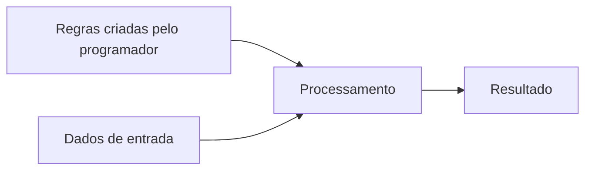
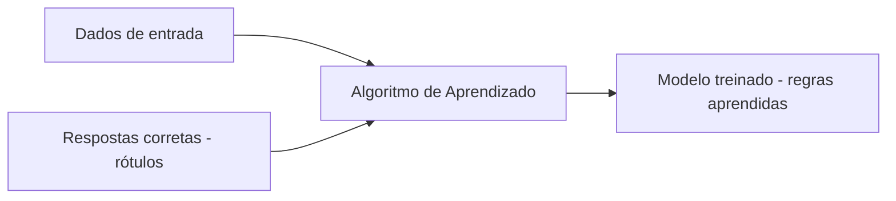
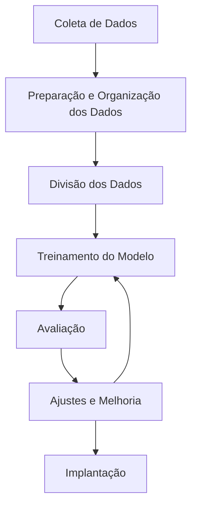

# 2. Machine Learning (Aprendizado de Máquina)

**Machine Learning** é um subcampo da Inteligência Artificial que desenvolve modelos capazes de aprender padrões a partir de dados e melhorar seu desempenho em uma tarefa específica ao longo do tempo.

Em vez de programar todas as regras manualmente, o desenvolvedor fornece exemplos, e o sistema constrói um modelo matemático capaz de generalizar para novos dados.

> É como ensinar uma criança com exemplos repetidos, permitindo que ela aprenda padrões, em vez de entregar um manual com todas as respostas possíveis.

 

## 2.1. Diferença entre Programação Tradicional e Machine Learning

- **Programação tradicional** → Você define explicitamente as regras e o sistema executa.

- **Machine Learning** → Você fornece dados e exemplos; o sistema aprende as regras automaticamente.

Em ML, os dados são o principal combustível do aprendizado.

 

## 2.2. Como Machine Learning funciona?

Embora existam variações, o processo geralmente segue estas etapas:

1. **Coleta de dados:** Coleta de informações relevantes (imagens, textos, números, históricos de comportamento etc.).
2. **Preparação e organização dos dados:** Limpeza, padronização e estruturação para que possam ser usados no treinamento.
3. **Divisão dos dados:** Parte dos dados é usada para treinar o modelo e outra parte para testá-lo.
4. **Treinamento do modelo:** O modelo analisa os dados e ajusta seus parâmetros internos para identificar padrões.
5. **Avaliação:** O modelo é testado com dados que nunca viu antes para verificar sua capacidade de generalização.
6. **Ajustes e melhoria:** O modelo é refinado até atingir um desempenho satisfatório.
7. **Implantação (uso real):** O modelo passa a fazer previsões ou tomar decisões em novos casos.

 

## 2.3. Tipos de Machine Learning

Existem três grandes abordagens de aprendizado em Machine Learning:

### 1️⃣ Aprendizado Supervisionado

### Conceito

O modelo aprende com dados que já possuem as respostas corretas (rótulos). Ele tenta prever essas respostas e ajusta seus parâmetros com base nos erros cometidos.

É como estudar com um professor que corrige cada exercício.

 

### Como funciona internamente

O processo segue um ciclo contínuo:

1. O modelo recebe uma entrada (uma imagem, por exemplo).
2. Ele gera uma previsão inicial.
3. A previsão é comparada com a resposta correta.
4. É calculada a diferença (erro).
5. O modelo ajusta seus parâmetros internos para reduzir o erro, utilizando técnicas de otimização, como o algoritmo de gradiente descendente.
6. O processo se repete milhares ou milhões de vezes.

Com o tempo, o modelo melhora sua capacidade de prever corretamente novos dados.

 

### Quando é usado

- Previsão de preços
- Classificação de e-mails como spam
- Diagnóstico médico assistido
- Detecção de fraude
- Reconhecimento de imagens rotuladas

O ponto central aqui é: **há uma resposta correta conhecida durante o treinamento.**

 

### 2️⃣ Aprendizado Não Supervisionado

### Conceito

O modelo recebe dados sem respostas prontas e precisa descobrir padrões ou estruturas por conta própria.

Não há “certo ou errado” explícito durante o treinamento.

 

### O que o modelo aprende

- Agrupar dados semelhantes
- Detectar comportamentos fora do padrão
- Identificar estruturas ocultas nos dados
- Reduzir complexidade de informações

É como entregar várias peças de quebra-cabeça sem a imagem final e pedir para alguém organizar grupos semelhantes.

 

### Quando é usado

- Segmentação de clientes
- Análise de comportamento
- Identificação de padrões ocultos
- Descoberta de tendências

Aqui, o objetivo não é prever uma resposta específica, mas **entender a estrutura dos dados**.

 

### 3️⃣ Aprendizado por Reforço

### Conceito

O modelo aprende por tentativa e erro, interagindo com um ambiente e recebendo recompensas ou punições com base em suas ações.

O foco não está em dados rotulados, mas em maximizar uma recompensa ao longo do tempo.

 

### Como funciona

1. O agente toma uma ação.
2. O ambiente responde.
3. O agente recebe uma recompensa (positiva ou negativa).
4. O agente ajusta sua estratégia.
5. O ciclo se repete.

O modelo aprende quais decisões geram melhores resultados no longo prazo.

 

#### Recompensa no Aprendizado por Reforço

No Aprendizado por Reforço, a **recompensa** é um sinal numérico que informa ao modelo se a ação tomada foi boa ou ruim em relação ao objetivo desejado.

Ela funciona como um mecanismo de feedback contínuo que orienta o aprendizado.

O objetivo do agente não é apenas receber recompensas imediatas, mas **maximizar a recompensa acumulada ao longo do tempo**.

> ### ✅ Recompensa Positiva
>
> 
>
> É um valor que indica que a ação tomada foi desejável ou aproximou o agente do objetivo.
>
> Ela aumenta a probabilidade de o modelo repetir esse comportamento no futuro.
>
> **Exemplo:**
>
> - IA jogando um jogo recebe +10 pontos por ganhar.
> - Um robô recebe recompensa ao alcançar o destino correto.
> - Um sistema de recomendação recebe recompensa quando o usuário clica em um item sugerido.
>
> Importante:
> Recompensa positiva não significa “perfeita”, apenas que a ação contribuiu para o objetivo.
>
>  
>
> ### ❌ Recompensa Negativa (ou Penalidade)
>
> 
>
> É um valor que indica que a ação tomada foi indesejada ou afastou o agente do objetivo.
>
> Ela reduz a probabilidade de o modelo repetir aquele comportamento.
>
> **Exemplo:**
>
> - IA recebe -5 pontos por perder uma vida no jogo.
> - Um carro autônomo recebe penalidade por se aproximar demais de um obstáculo.
> - Um sistema recebe penalidade quando o usuário ignora repetidamente uma sugestão.

 

> [!WARNING]
>
> Recompensa não é necessariamente “emocional” — é um **valor matemático** que guia o modelo a ajustar sua estratégia.

 

O aprendizado ocorre porque o agente busca maximizar a recompensa a longo prazo, o que faz com que o modelo aprenda estratégias inteligentes, mesmo que precise aceitar pequenas penalidades no curto prazo para obter ganhos maiores no futuro.

 

### Analogia

> É como treinar um cachorro com petiscos: comportamentos corretos são recompensados, aumentando a probabilidade de repetição.

 

### Onde é aplicado

- Jogos (IA que aprende a jogar sozinha)
- Robótica
- Sistemas autônomos
- Otimização de decisões complexas
- Controle de processos industriais

 

### Resumo Comparativo

| Tipo de Aprendizado         | Como Funciona                                                | Característica Principal                       |
| --------------------------- | ------------------------------------------------------------ | ---------------------------------------------- |
| **Supervisionado**          | Aprende utilizando dados que já possuem respostas corretas (rótulos). | Há uma resposta correta durante o treinamento. |
| **Não Supervisionado**      | Analisa dados sem respostas prontas e identifica padrões ou estruturas. | Descobre padrões ocultos nos dados.            |
| **Aprendizado por Reforço** | Aprende por tentativa e erro, recebendo recompensas ou penalidades. | Busca maximizar recompensas ao longo do tempo. |

 