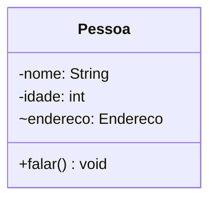
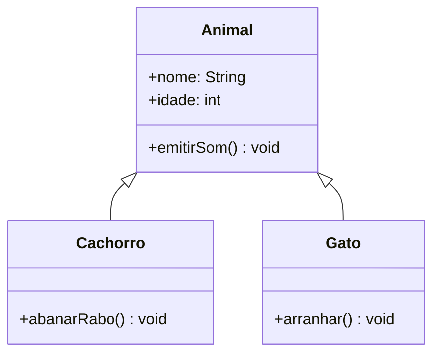
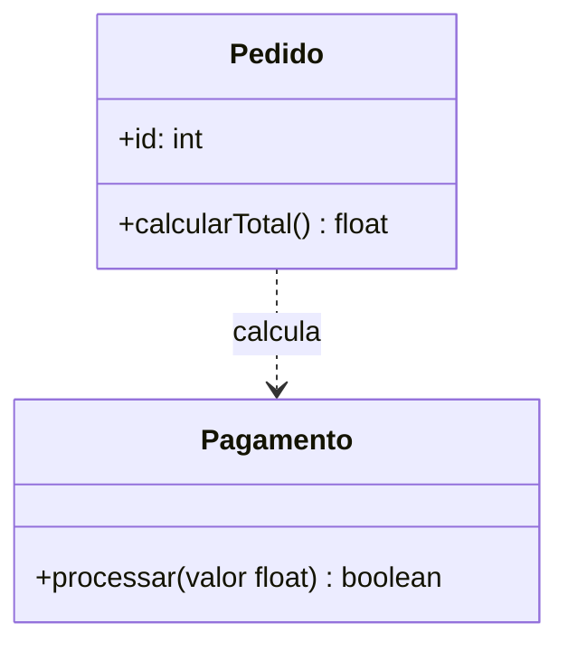
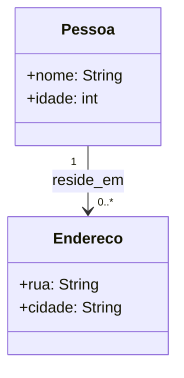
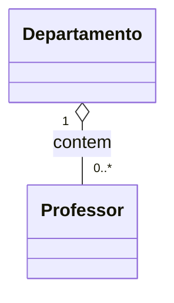
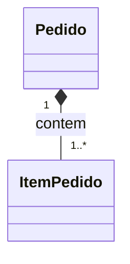
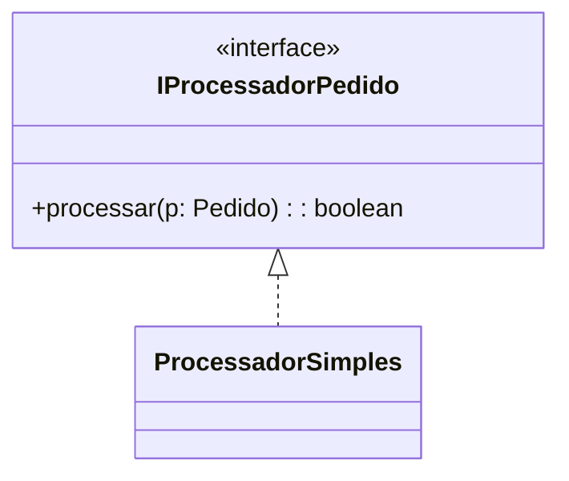
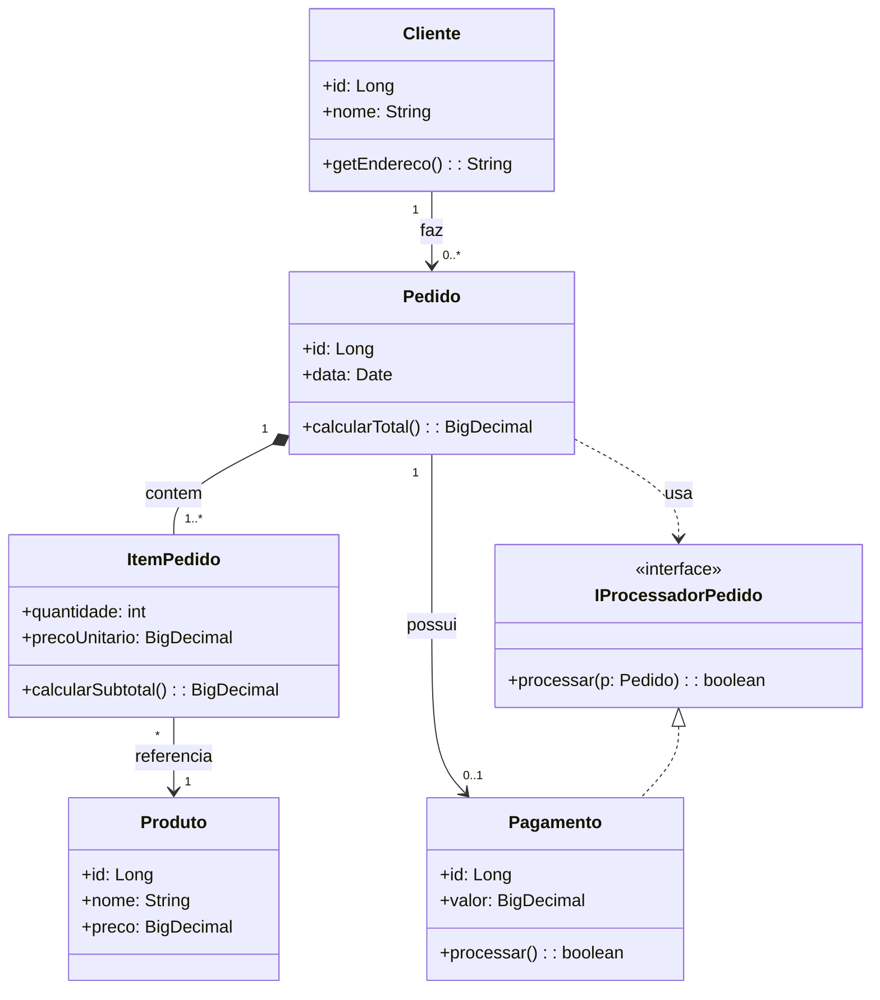

# Guia Prático da UML - Unified Modeling Language

A **UML (Unified Modeling Language)** é uma linguagem padronizada para modelar sistemas de software usando diagramas. Ela não gera código automaticamente por si só, mas é uma ferramenta poderosa para pensar, planejar e comunicar a estrutura e o comportamento de um sistema antes (ou durante) a implementação.

Para iniciantes em orientação a objetos (OO), aprender UML ajuda a visualizar classes, responsabilidades e relações — tornando mais fácil projetar software com clareza e evitar problemas de arquitetura.

A UML abrange todos os aspectos de desenvolvimento de software:

- Arquitetura de sistemas
- Requerimentos
- Testes
- Plano de projeto

 

## 1. Modelagem de software

Um modelo de software é uma simplificação da realidade em um modelo virtual. A modelagem se baseia em 3 princípios:

1. Visualizar como o sistema funcionará ao ser concluído;
2. Especificar a estrutura e os comportamentos (ações e interações) do sistema;
3. Orientar o processo de desenvolvimento a partir de modelos gráficos.

A modelagem de software possui 2 objetivos principais:

1. Melhorar a comunicação e a compreensão entre os stakeholders (pessoas envolvidas com o sistema), através da representação gráfica;
2. Documentar o comportamento e a estrutura do sistema antes da codificação.

 

### 1.1. Vantagens

As principais vantagens do uso da UML são :

- Não precisamos pagar nada para utilizar a UML
- A UML gera benefícios com a integração de diversas práticas de modelagem
- A UML não está associada ao processo que a pessoa desenvolvedora de software utiliza
- A UML pode ser utilizada em qualquer etapa do desenvolvimento
- A UML pode ser estendida

 

## 2. Diagramas da UML

A UML classifica os seus Diagramas em 2 categorias:

 

### 2.1. Diagramas Estruturais (Estáticos)

São os diagramas utilizados para modelar a **estrutura** do sistema, ou seja, os elementos estáticos e como eles se organizam.

| Diagrama                                 | Descrição                                                    |
| ---------------------------------------- | ------------------------------------------------------------ |
| **Diagrama de Casos de Uso**             | Representa uma visão externa do sistema, mostrando **atores** (usuários ou sistemas externos) e os **casos de uso** (funcionalidades que o sistema deve oferecer). É útil para capturar requisitos funcionais. |
| **Diagrama de Classes**                  | Modela a estrutura estática do sistema, identificando **classes**, **atributos**, **operações** e seus **relacionamentos**. É um dos diagramas mais centrais da UML. |
| **Diagrama de Objetos**                  | Mostra instâncias concretas de classes em um momento específico, evidenciando objetos reais e suas ligações. Usa a mesma notação do diagrama de classes. |
| **Diagrama de Componentes**              | Modela a organização e a dependência entre **componentes de software**, como módulos, bibliotecas, serviços, frameworks ou executáveis. Útil para arquiteturas modulares. |
| **Diagrama de Implantação (Deployment)** | Representa a disposição física do sistema, mostrando **nós** (como servidores, dispositivos e contêineres) e os **componentes** implantados neles, além das conexões de comunicação. |
| **Diagrama de Pacotes**                  | Organiza elementos do modelo em **pacotes**, permitindo visualizar dependências e modularização do sistema. |
| **Diagrama de Estrutura Composta**       | Detalha a **estrutura interna** de uma classe ou componente, evidenciando suas partes constituintes e as colaborações internas. |
| **Diagrama de Perfis**                   | Permite **estender a UML** por meio de estereótipos, restrições e valores específicos de um domínio. É usado para adaptações da UML a contextos particulares. |

 

### 2.2. Diagramas Comportamentais (Dinâmicos)

São os diagramas utilizados para modelar o **comportamento** do sistema ao longo do tempo, descrevendo interações, fluxos e estados.

| Diagrama                           | Descrição                                                    |
| ---------------------------------- | ------------------------------------------------------------ |
| **Diagrama de Casos de Uso**       | (também listado entre estruturais, mas classificado oficialmente como comportamental) – foca no comportamento esperado do sistema a partir da interação dos atores com os casos de uso. |
| **Diagrama de Atividades**         | Modela **fluxos de atividades** dentro de um processo ou funcionalidade, incluindo decisões, paralelismo e sincronização. |
| **Diagrama de Máquina de Estados** | Descreve os **estados possíveis** de um objeto ou sistema e as **transições** entre eles em resposta a eventos. |
| **Diagrama de Sequência**          | Mostra a **troca de mensagens ao longo do tempo** entre objetos, atores ou componentes, enfatizando a ordem temporal das interações. |
| **Diagrama de Comunicação**        | (anteriormente chamado de diagrama de colaboração) – mostra como os objetos interagem por meio de mensagens, destacando a rede de relacionamentos em vez da ordem temporal. |
| **Diagrama de Temporização**       | Específico para sistemas sensíveis a tempo, mostra as mudanças de estado ou condição em função de uma linha temporal contínua. |
| **Diagrama de Interação Geral**    | Oferece uma visão panorâmica de várias interações (como sequências e comunicações), permitindo modelar cenários complexos de forma mais abstrata. |

Neste capítulo, apresentamos uma visão geral dos principais tipos de diagramas que a UML disponibiliza. A partir deste ponto, concentraremos nossa atenção no **Diagrama de Classes**, por ser a base da modelagem orientada a objetos e um dos mais utilizados no processo de análise e desenvolvimento de sistemas.

 

## 3. Diagrama de Classes

O Diagrama de Classes serve para mapear os elementos essenciais do domínio do problema: as entidades (classes), suas propriedades (atributos), comportamentos (métodos) e como elas se conectam. Antes de escrever código, desenhar um diagrama de classes ajuda a organizar responsabilidades, identificar duplicação e ajustar dependências.

Use o diagrama quando precisar: projetar um módulo, revisar o design com a equipe, documentar uma API ou transformar requisitos em uma estrutura de classes.

 

### 3.1. Estrutura de uma classe (notação e exemplos)

Uma classe em UML costuma ser representada por um retângulo dividido em três partes: nome, atributos e métodos. A notação também indica a visibilidade dos membros e outras informações (tipo, multiplicidade, estereótipos).

👉 **Exemplo de sintaxe básica (representação textual UML):**

 

### ✅ Estrutura do Diagrama de Classes

1. **Nome da Classe**
   - Localizado na parte superior. 
   - Geralmente é escrito com a primeira letra maiúscula, seguindo a convenção da linguagem Java.
   - **Exemplo:** `Gato`

2. **Atributos (ou Propriedades)**
   - Representam os **dados** ou características da classe.
   - São escritos com o seguinte padrão:
     `visibilidade nome : tipo`
   - **Exemplo:** `- idade : int`

3. **Métodos (ou Operações)**

   - Representam os **comportamentos** ou ações que a classe pode executar.
   - Seguem o padrão: `visibilidade nome(parâmetros) : tipoRetorno`

   - Exemplo: `+ comer(quantidade: float) : void`

 

### ✅ Convenções de Visibilidade

A **visibilidade** define quem pode acessar um atributo ou método dentro de uma classe. Sua principal função é **controlar o nível de acesso** aos elementos internos, ajudando a reduzir o acoplamento entre classes e a manter a segurança das informações.

No **Diagrama de Classes da UML**, utilizamos símbolos antes dos atributos e métodos para indicar a visibilidade (também chamada de modificador de acesso):

| Símbolo | Visibilidade                            | Acesso permitido por                | Quando usar                                                  |
| ------- | --------------------------------------- | ----------------------------------- | ------------------------------------------------------------ |
| `+`     | **Pública**                             | Qualquer classe                     | Quando o atributo ou método precisa ser acessado livremente em todo o sistema. |
| `-`     | **Privada**                             | Apenas a própria classe             | Quando deseja ocultar detalhes internos e garantir que o acesso ocorra somente pela própria classe. |
| `#`     | **Protegida**                           | A própria classe e suas subclasses  | Quando o elemento deve ser herdado e usado por subclasses, mas não por outras classes externas. |
| `~`     | **Friendly** (*padrão/package-private*) | Qualquer classe do **mesmo pacote** | Quando deseja permitir acesso apenas dentro do mesmo pacote, mantendo isolamento em relação a pacotes externos. |

 

### ✅ Observações importantes

No **UML tradicional**, algumas convenções ajudam a identificar elementos especiais dentro do diagrama de classes:

- **Membros estáticos** são representados com sublinhado.
- **Classes abstratas** aparecem em itálico ou são marcadas com o estereótipo `<<abstract>>`.
- Em ferramentas gráficas — como o Mermaid — pode haver limitações para usar itálico ou sublinhado. Nesses casos, é comum recorrer a **estereótipos** (`<<interface>>`, `<<abstract>>`, entre outros) para indicar a natureza da classe ou do elemento.

 

> O **Mermaid** é uma linguagem de marcação declarativa que permite criar **diagramas e visualizações** a partir de texto simples. Com ele, é possível elaborar **fluxogramas**, **diagramas UML**, **diagramas de entidade-relacionamento (DER)**, entre outros modelos gráficos.
>
> Sua proposta é ser **fácil de aprender** e **rápido de integrar** em ambientes de documentação e colaboração, como **Markdown**, **GitHub**, **Notion** e diversos editores compatíveis.
>
> É importante destacar que a notação Mermaid **não faz parte oficialmente da UML** (padrão mantido pela OMG), mas sim uma ferramenta prática que oferece **uma sintaxe inspirada** na UML, permitindo a criação de diagramas semelhantes de forma ágil e acessível.

 

### 👉 Exemplo (classe simples)

*Neste exemplo a propriedade `endereco` tem visibilidade `~` (friendly).*

 

### ✅ Tipos de membros e convenções rápidas

Na UML, os **atributos** podem especificar tipo, valor padrão e multiplicidade (por exemplo: `enderecos: List<Endereco>` ou `enderecos: Endereco [0..*]`). Já os **métodos** mostram parâmetros e tipo de retorno.

Algumas convenções importantes:

- Nome de classes em **PascalCase** 
  - **Exemplo:** `PedidoItem`).
- Atributos e métodos em **camelCase** 
  - **Exemplo:** `numeroPedido`, `calcularTotal`
- Indique a **multiplicidade** quando for relevante, pois ela define **quantas instâncias de uma classe podem estar associadas a outra** (semelhante a cardinalidade nos bancos de dados relacionais).

 

### ✅ Multiplicidade na UML

A multiplicidade é indicada ao lado da classe relacionada e descreve **a quantidade mínima e máxima** de objetos que podem participar de uma associação. Os valores mais comuns são:

| Notação | Significado                                         | Exemplo prático (sistema do dia a dia)                       |
| ------- | --------------------------------------------------- | ------------------------------------------------------------ |
| `1`     | Exatamente uma instância                            | Cada **pedido** pertence a **um único cliente**.             |
| `0..1`  | Zero ou uma instância (opcional)                    | Um **cliente** pode ter ou não um **endereço de entrega**.   |
| `*`     | Nenhuma ou várias instâncias (quantidade ilimitada) | Um **cliente** pode ter **vários pedidos** (ou nenhum).      |
| `1..*`  | Pelo menos uma instância, podendo haver várias      | Um **pedido** deve ter **pelo menos um item**, mas pode ter muitos. |

 

## 4. Relacionamentos entre classes 

As classes interagem entre si por meio de **relacionamentos**, que representam como os objetos se conectam, colaboram ou dependem uns dos outros dentro do sistema. Esses relacionamentos ajudam a organizar a estrutura do software, definir responsabilidades e controlar o fluxo de informações entre as classes.

Nos próximos tópicos, vamos conhecer os principais tipos de relacionamento entre classes:

 

### 4.1. Herança

- **O que é:** Herança é um mecanismo da programação orientada a objetos pelo qual uma **subclasse** adquire atributos e comportamentos de uma **superclasse**. Esse relacionamento é conhecido como “**é-um**”, pois a subclasse **é um tipo especializado** da superclasse.
- **Vantagens:** promove **reuso de código**, facilita a manutenção e garante consistência nos comportamentos compartilhados entre classes relacionadas.
- **Analogia do dia a dia:** um `Cachorro` **é um tipo de** `Animal`; assim como um `Gato` também é um tipo de `Animal`. Ambos herdam características comuns, como `nome` ou `idade`, da superclasse `Animal`.

👉**Exemplo:**

- **Quando usar:** utilize herança quando houver **verdadeiro compartilhamento de atributos e comportamentos**, e a relação “é-um” fizer sentido conceitualmente.
- **Observação importante:** prefira **composição** sobre herança quando o compartilhamento de comportamento não justificar um vínculo rígido “é-um”, pois composição tende a gerar sistemas mais flexíveis e de fácil manutenção.

 

### 4.2. Dependência

- **O que é:** Dependência é uma **relação fraca e geralmente temporária** entre duas classes, na qual uma classe **usa** outra para realizar uma operação, sem manter vínculo permanente.
- **Analogia do dia a dia:** um **cozinheiro** utiliza uma **faca** apenas enquanto cozinha — após o uso, a faca continua existindo, mas não está “presa” ao cozinheiro.

👉**Exemplo:**

- **Interpretação:** a linha pontilhada com seta indica que **Pedido depende de Pagamento** para executar a operação `calcularTotal` ou aprovar o pedido, mas não mantém uma associação permanente com ele.
- **Quando usar:** utilize dependência para situações em que uma classe precisa temporariamente de outra, como parâmetros de método, chamadas de serviços ou objetos auxiliares, sem estabelecer acoplamento forte.

 

### 4.3. Associação

- **O que é:** A associação é uma **ligação direta entre duas classes**, indicando que instâncias de uma conhecem ou utilizam instâncias da outra. É a forma mais básica de relacionamento em UML.
- **Analogia do dia a dia:** uma **pessoa reside em um endereço**. A pessoa conhece o endereço, e o endereço está associado à pessoa, mas ambos existem independentemente.
- **Características principais:**
  - **Navegabilidade:** define **quem conhece quem**; uma seta indica a direção da associação.
  - **Papéis (roles):** permitem nomear o papel que cada classe exerce na relação.
  - **Multiplicidade:** indica quantas instâncias de uma classe podem se relacionar com instâncias da outra.

👉**Exemplo:**

**Interpretação:**

- Uma `Pessoa` pode ter **nenhum ou vários endereços** (`0..*`).
- A seta (→) indica que a `Pessoa` conhece os `Enderecos` associados.
- Cada `Endereco` não depende exclusivamente da `Pessoa` para existir; é um relacionamento **flexível e bidirecional** quando necessário.

 

### 4.4. Agregação e  Composição (diferença essencial)

Tanto a **agregação** quanto a **composição** representam relações **todo-parte** entre classes, mas diferem na **intensidade do vínculo** e no **ciclo de vida dos objetos**.

 

#### 4.4.1. Agregação

- **O que é:** relação “todo-parte” onde o **objeto parte pode existir independentemente** do todo. Representa uma ligação mais **fraca** entre as classes.

- **Analogia do dia a dia:** um `Departamento` **contém** `Professor`. Se o departamento deixar de existir, os professores continuam existindo e podem ser transferidos para outro departamento.

  

👉**Exemplo:**

- **Interpretação:** a linha com diamante aberto (`o--`) indica que o `Departamento` **agrega** `Professor`, mas a existência do `Professor` **não depende do Departamento**.
- **Quando usar:** quando o todo precisa agrupar partes sem controlar seu ciclo de vida, ou seja, quando os objetos podem existir de forma independente.

 

#### 4.4.2. Composição

- **O que é:** relação “todo-parte” onde o **objeto parte depende do todo** para existir; o ciclo de vida é compartilhado, tornando a ligação **forte**.

- **Analogia do dia a dia:** um `Pedido` **contém** `ItemPedido`. Se o pedido for excluído, seus itens também deixam de existir, pois são parte integrante do todo.

  

👉**Exemplo:**

- **Interpretação:** a linha com diamante preenchido (`*--`) indica que `ItemPedido` **não existe fora do Pedido**; seu ciclo de vida é dependente do todo.
- **Quando usar:** quando a existência do objeto parte **depende totalmente do todo**, garantindo consistência e integridade do sistema.

 

**Resumo:**

- Agregação → relação **flexível**, partes independentes.
- Composição → relação **forte**, partes dependentes.

A escolha correta entre agregação e composição impacta **regras de negócio, ciclo de vida de objetos e persistência em banco de dados**.

 

### 4.5. Realização (Interfaces)

- **O que é:** uma classe **realiza** (implementa) uma interface. A interface define um **contrato**, ou seja, um conjunto de métodos que devem ser implementados, mas **sem fornecer implementação concreta**.
- **Analogia do dia a dia:** uma tomada elétrica define um padrão de pinos e voltagem. Qualquer eletrodoméstico compatível **realiza** esse padrão; cada eletrodoméstico implementa a funcionalidade à sua maneira.

👉**Exemplo:**

- **Interpretação:** a linha tracejada com triângulo mão preenchido indica que `ProcessadorSimples` **implementa a interface** `IProcessadorPedido`, ou seja, cumpre o contrato definido pela interface.
- **Quando usar:** utilize interfaces quando desejar **definir comportamentos comuns** que podem ser implementados por várias classes diferentes, permitindo **polimorfismo** e maior flexibilidade no design do sistema.

 

## 5. Notações e detalhes úteis 

- **Abstract:** classes abstratas definem comportamento incompleto; use `<<abstract>>` ou itálico para indicar.  
- **Static:** membros estáticos são sublinhados no UML clássico; em ferramentas simples você pode adicionar um comentário `<<static>>`.  
- **Stereotypes:** `<<interface>>`, `<<entity>>`, `<<controller>>` ajudam a classificar elementos.  
- **Notas:** use notas no diagrama para explicar decisões (por exemplo, justificar uma agregação em vez de composição).

 

## 6. Exemplo completo de Diagrama de Classes 

Abaixo um exemplo que junta vários conceitos: Cliente, Pedido, ItemPedido, Produto, Pagamento, e uma interface de processamento de pedidos.

Neste diagrama: `Pedido` compõe `ItemPedido` (itens não existem fora do pedido); `ItemPedido` referencia `Produto`; `Pedido` tem um `Pagamento` opcional; `Pagamento` realiza a interface `IProcessadorPedido`.

 

## 7. Boas práticas ao criar diagramas

- **Comece pequeno:** modele primeiro as principais entidades do domínio.  
- **Prefira clareza:** não coloque todos os detalhes em um único diagrama. Faça visões separadas (exemplo: diagrama de domínio, diagrama de persistência).  
- **Nomeie papéis e multiplicidades:** isso ajuda muito quem lê.  
- Evite modelar detalhes de implementação desnecessários no início (como tipos específicos de banco).  
- Use estereótipos e notas para explicar decisões que não são óbvias.

