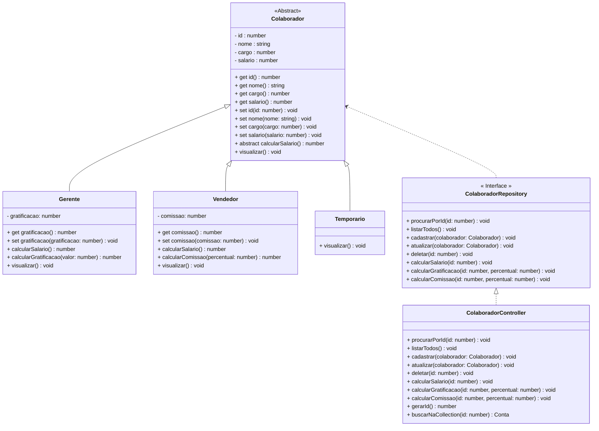

<h1>Sistema de Gerenciamento de um RH</h1>

*Dado o Diagrama de Classes abaixo, construa uma aplicação que contenha um Menu principal, que forneça todas as operações do CRUD para um Sistema de RH:*

 

<h2>Menu Principal</h2>

 

**Observações:**

- Gratificação e Comissão iniciam zeradas
- A Opção 6 - Calcular Salário deve ser aplicado somente aos Objetos das Classes Gerente e Vendedor
- A Opção 7 - Calcular Gratificação deve ser aplicada somente aos Objetos da Classe Gerente
- A Opção 8 - Calcular Comissão deve ser aplicada somente aos Objetos da Classe Vendedor
- Observe que os Objetos da Classe Temporário não podem executar o método Calcular Salário, porque o temporário tem salário fixo, mas o Método Calcular Salário será implementado na Classe porque é um Método Abstrato. Como resolver este problema, utilizando interfaces?

 

**Cálculos:**

- **Calcular Salário:** 
  - **Gerente:** salario + gratificacao (calculada)
  - **Vendedor:** salario + comissao (calculada)

- **Calcular Gratificação:** (percentual / 100) * salario  
  - *Adicionar o resultado no atributo gratificacao*
  - *O Percentual não pode ultrapassar 40%*

- **Calcular Comissão:** (percentual / 100) * salario
  - *Adicionar o resultado no atributo comissao*
  - *O Percentual não pode ultrapassar 10%*

